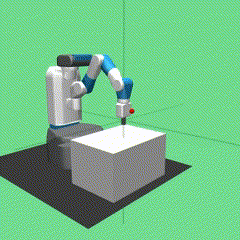
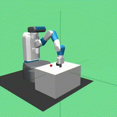
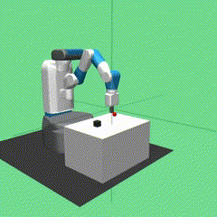

# Fetch Mobile Manipulator
#### Off-policy learning in robotics simulation with Fetch mobile manipulator.

## Abstract

In robotics, physics-based simulations are crucial for training real-life robots. Simulations have seen adoption accelerated by the rapid growth in computational power over the last three decades (Liu & Negrut, 2021). Robots are very complicated systems, training them in the real world can be challenging, since execution and feedback is slow. Physics-based simulation allows sampling experience millions times faster than in the real world, making it possible to train very complicated robots. 

In this project, we apply Off-Policy Deep Reinforcement Learning methods to Fetch Mobile Manipulator, a 7-DoF arm with a two-fingered parallel gripper attached to it. We train the Fetch robot to solve tasks such as Reach, Push, Pick and Place or Slide.

## Supported algorithms

Supported algorithms are listed below:
- [Deep Deterministic Policy Gradient (DDPG)](https://arxiv.org/pdf/1509.02971.pdf)
- [Twin Delayed DDPG (TD3)](https://arxiv.org/pdf/1802.09477.pdf)
- [Soft Actor-Critic (SAC)](https://arxiv.org/pdf/1812.05905.pdf)
- [Randomized Ensembled Double Q-Learning (REDQ)](https://arxiv.org/pdf/2101.05982.pdf)
- [Hindsight Experience Replay (HER)](https://arxiv.org/abs/1707.01495)

## Usage

### Installing requirements
The first step is to install requirements. Create a virtual environment (venv) and install all dependencies in it from [requirements.txt](./requirements.txt).

### Training
We can either:
- train each algorithm individually using using *run configurations*, like we did in [first_benchmark](./first_benchmark). 
- use Jupyter Notebooks to run multiple algorithms one after the other, like we did in [second_benchmark](./second_benchmark).

### Training with run configurations
Execute each off-policy learning algorithm in each environment individually and wait for results.

### Training with Jupyter Notebooks
Execute all training tasks in one notebook, to benchmark 4 off-policy learning algorithms in that specific environment. To best use computational resources, we suggest executing 4 notebooks at the same time in parallel. Each notebook takes approximately the same time to execute as other notebooks. When execution is complete, multiple details are saved in the notebooks. This includes speed of training, running times for training and testing, best scores etc.

### Plotting graphs with Tensorboard
Pretrained agents and logs are saved in `./log` folder.
We can monitor the logs with Tensorboard to generate graph plots.

```bash
$ tensorboard --logdir log
```

## Results from first benchmark
All results from the first benchmark in our experiments are saved in the [first_benchmark](./first_benchmark) folder.
 - [first_benchmark/log](./first_benchmark/log) folder: contains all pretrained agents and logs, which can be plotted with Tensorboard.
 - [first_benchmark/plots](./first_benchmark/plots) folder: graph plots generated with Tensorboard.
 - [first_benchmark/outputs](./first_benchmark/outputs) folder: contains command line outputs from the beginning of training until the end of training for each training task.

## Video demonstrations
For each task solved by an algorithm, we have generated video demonstrations of our pretrained agents and saved the videos in the [demonstrations](./demonstrations) folder.

To generate new videos, simply run the script [demonstrations/demonstrations.py](./demonstrations/demonstrations.py). This will generate new videos for all training tasks in all environments in batch.

### Example: Pretrained agents using REDQ

| Fetch Reach | Fetch Push | Fetch Pick and Place                                                                  |
|-------------|------------|---------------------------------------------------------------------------------------|
|  |  |  |
