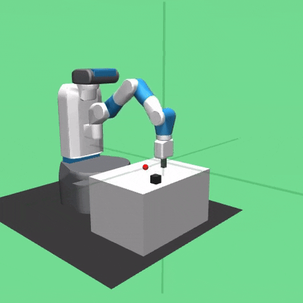

# Fetch Mobile Manipulator
### Off-policy learning in robotics simulation with Fetch mobile manipulator

## Video demonstrations

| Fetch Reach | Fetch Push | Fetch Pick and Place                                                                  |
|-------------|------------|---------------------------------------------------------------------------------------|
|  |  |  |

For each task, we have generated video demonstrations of our pretrained agents and saved the videos in the [demonstrations](./demonstrations) folder.

To generate new videos, simply run the script [demonstrations/demonstrations.py](./demonstrations/demonstrations.py). This will generate new videos for all training tasks in all environments in batch.

## Abstract

In robotics, physics-based simulations are crucial for training real-life robots. Simulations have seen adoption accelerated by the rapid growth in computational power over the last three decades (Liu & Negrut, 2021). Robots are very complicated systems, training them in the real world can be challenging, since execution and feedback is slow. Physics-based simulation allows sampling experience millions times faster than in the real world, making it possible to train very complicated robots. 

In this project, we apply Off-Policy Deep Reinforcement Learning methods to Fetch Mobile Manipulator, a 7-DoF arm with a two-fingered parallel gripper attached to it. We train the Fetch robot to solve tasks such as Reach, Push, Pick and Place or Slide.

## Supported algorithms

Supported algorithms are listed below:
- [Deep Deterministic Policy Gradient (DDPG)](https://arxiv.org/pdf/1509.02971.pdf), [commit id](https://github.com/thu-ml/tianshou/tree/e605bdea942b408126ef4fbc740359773259c9ec)
- [Twin Delayed DDPG (TD3)](https://arxiv.org/pdf/1802.09477.pdf), [commit id](https://github.com/thu-ml/tianshou/tree/e605bdea942b408126ef4fbc740359773259c9ec)
- [Soft Actor-Critic (SAC)](https://arxiv.org/pdf/1812.05905.pdf), [commit id](https://github.com/thu-ml/tianshou/tree/e605bdea942b408126ef4fbc740359773259c9ec)
- [Randomized Ensembled Double Q-Learning (REDQ)](https://arxiv.org/pdf/2101.05982.pdf), [commit id](https://github.com/thu-ml/tianshou/tree/dd16818ce4392cd82a44a8450529450dbf759666)
- [Hindsight Experience Replay (HER)](https://arxiv.org/abs/1707.01495), [commit id](https://github.com/thu-ml/tianshou/tree/d42a5fb3542ab1db49b051aa4fe24cdbadf842a3)

## Usage

Refer to the [benchmark](./benchmark) folder to reproduce the experimental results.
1. Create a virtual environment (venv) and install all dependencies in it from [requirements.txt](./requirements.txt).
2. Train each algorithm individually using *run configurations*. 
3. Pretrained agents and logs are saved in `./log` folder.
We can monitor the logs with Tensorboard to generate graph plots.

```bash
$ tensorboard --logdir log
```

## Results
All results from our experiments are saved in the [benchmark](./benchmark) folder.
 - [benchmark/log](benchmark/log): contains all pretrained agents and logs, which can be plotted with Tensorboard.
 - [benchmark/plots](benchmark/plots): graph plots generated with Tensorboard.
 - [benchmark/outputs](benchmark/outputs): contains command line outputs from the beginning of training until the end of training for each training task.

